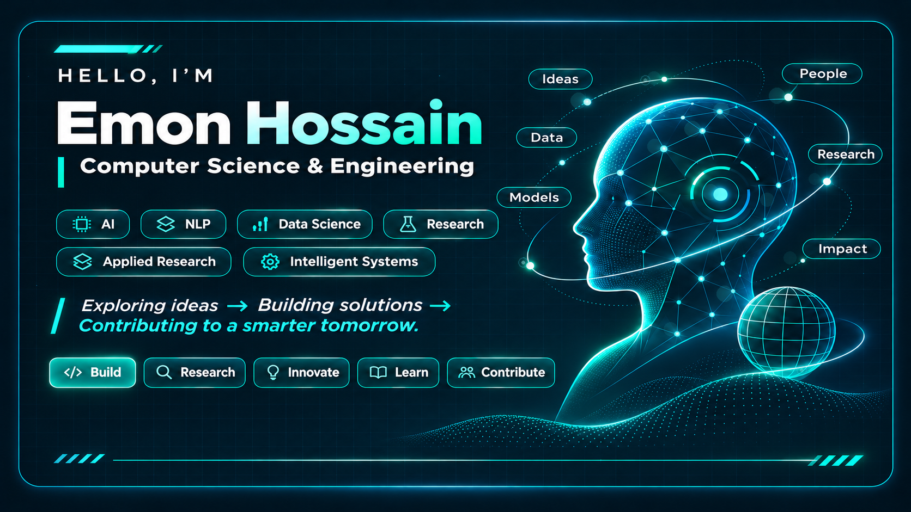

<!--
  EMON-721 / EMON-721 — public GitHub profile README
  Research and Applied Work Profile — updated 6 November 2026.
  Every section below is deliberately editable. See EDITING_GUIDE.md.
  IMPORTANT: Do not publish private repositories, credentials, financial data,
  transcripts, or unverified publication / contribution figures in this public repo.
-->

<!-- ================ HERO: REAL PORTRAIT, ANIMATED DESIGN ================ -->
<table>
<tr>
<td width="72%" valign="top"></td>
<td width="28%" valign="middle" align="center">
<b>Emon Hossain</b> EMON-721 · CSE Student · Dhaka, Bangladesh
</td>
</tr>
</table>

**CSE Student at University of Liberal Arts Bangladesh (ULAB) | Research & Industry-Oriented Applications**

Exploring ideas through rigorous research and turning evidence into practical, industry-relevant solutions.

[**Featured Projects**](#05--featured-repositories--projects) · [**Research Flow**](#01--research--animated-concept-map) · [**About & Education**](#02--about-me--education--research--industry) · [**Skills**](#04--technical-skills--tools) · [**Research Notes**](#06--research--publications) · [**Connect**](#08--connect-with-me--open-to-collaboration)

---

<!-- ================ RESEARCH CONCEPT MAP: EDIT assets/research-concept-map.svg ================ -->
## 01 / Research · Animated concept map

  
  Four rotating concept modes · flowing signal paths · four stages and twelve nodes · conceptual illustration.

The connected-node animation illustrates four research workflows. Expand a subject to explore its stages.

<b>01 · Machine Learning — Input → Features → Model → Insight</b>

Experimentation, pattern discovery, evaluation, prediction, and explainability.

<b>02 · Artificial Intelligence — Data → Represent → Reason → Impact</b>

Applied intelligence, reasoning, human-centered AI and responsible systems.

<b>03 · Language & NLP — Text → Tokens → Context → Meaning</b>

Text understanding, multilingual NLP, information retrieval, transformers and RAG.

<b>04 · Data Science — Collect → Clean → Analyse → Impact</b>

Statistical inquiry, feature analysis, useful visualizations and reproducible evidence.

<b>Previous research cycle · optional archive</b>

**[Edit research content](https://github.com/EMON-721/EMON-721/edit/main/README.md)** · **[Manage animation source](https://github.com/EMON-721/EMON-721/blob/main/assets/research-concept-map.svg)**

---

<!-- ================ ABOUT / EDUCATION / RESEARCH: EDITABLE ================ -->
## 02 / About Me · Education · Research & Industry

<table><tr><td width="33%" valign="top">
<h3>About Me</h3>

I'm <b>Emon Hossain</b>, a <b>Computer Science &amp; Engineering (CSE) student at ULAB</b>. My work brings together analytical thinking, experimentation, and practical project development.

I'm interested in research-informed, industry-relevant applications: identifying real problems, testing ideas, and measuring how well solutions work.

Curiosity · Applied research · Industry relevance · Continuous learning

<a href="https://github.com/EMON-721/EMON-721/edit/main/README.md">✎ Edit · ＋ Add Strength</a>

</td><td width="34%" valign="top">
<h3>Education</h3>
 

<b>B.Sc. in Computer Science &amp; Engineering</b> University of Liberal Arts Bangladesh (ULAB) Dhaka, Bangladesh · <b>In progress</b>

<a href="https://github.com/EMON-721/EMON-721/edit/main/README.md">✎ Update · ＋ Add Education</a>

</td><td width="33%" valign="top">
<h3>Research &amp; Industry-Oriented Work</h3>

<b>Research:</b> I investigate problems using datasets, baselines, experiments, and reproducible evaluation.

<b>Applied projects:</b> My portfolio explores service platforms, learning tools, and data-supported workflows with attention to user needs, usability, and measurable outcomes. This is project-based work, not a claim of professional industry employment.

Approach: Define problem → Analyse evidence → Prototype → Evaluate → Improve

<a href="#06--research--publications">Research and publications ↗</a>

</td></tr></table>

---

<!-- ================ INTERESTS & CURRENT FOCUS ================ -->
## 03 / Interests · Research & Industry Applications

<code>Applied Intelligence</code> · <code>Industry R&amp;D</code> · <code>Information Retrieval</code> · <code>Decision Support</code> · <code>Deep Learning</code> · <code>Responsible Technology</code>

<table><tr><td width="50%" valign="top">
<h3>Research priorities</h3>
<ul>
<li>Meaningful problem formulation and strong baselines</li>
<li>Model evaluation, robustness and explainable results</li>
<li>Language understanding, retrieval and recommendation methods</li>
<li>Reproducible experiments and evidence-based conclusions</li>
</ul>
</td><td width="50%" valign="top">
<h3>Industry applications</h3>
<ul>
<li>Turning research prototypes into useful workflows</li>
<li>Data-driven decision support and process improvement</li>
<li>Search, recommendation and intelligent assistance</li>
<li>Usability, reliability and measurable practical impact</li>
</ul>
</td></tr></table>

<a href="https://github.com/EMON-721/EMON-721/edit/main/README.md">✎ Edit · ＋ Add Interest · ↕ Reorder</a>

---

<!-- ================ SKILLS & RESEARCH TOOLKIT ================ -->
## 04 / Technical Skills · Research Toolkit

| Core focus | Tools and working methods |
| --- | --- |
| **Programming & data analysis** | Python · Jupyter Notebook · Google Colab · NumPy · pandas |
| **Machine learning** | scikit-learn · PyTorch · TensorFlow · model training and validation |
| **Language & retrieval** | Hugging Face Transformers · NLTK · spaCy · embeddings · retrieval / RAG |
| **Data science & visualization** | SQL · MySQL · Matplotlib · Seaborn · exploratory analysis |
| **Research workflow** | Experimental design · feature engineering · performance metrics · error analysis |
| **Project collaboration** | Git · GitHub · documentation · testing · iterative prototyping |

**Areas of expertise:** computational problem-solving, intelligent modeling, language-focused analysis, and evidence-driven evaluation. The toolkit lists relevant frameworks and working methods; individual proficiency can be updated as projects are documented.

<a href="https://github.com/EMON-721/EMON-721/edit/main/README.md">✎ Edit · ＋ Update Tools</a>

---

<!-- ================ PROJECTS: ALL CONNECTED REPOSITORIES, ANIMATED ================ -->
## 05 / Featured Repositories · Projects

**15 selected repository projects are featured below (12 public, 3 private).** This is a curated project showcase, not a live account-wide repository count. Published website links are included where known; availability may vary. Emon's MS Journey has no website link, as requested.

<b>Compact project directory · easy to navigate on mobile</b>

- [Emon Portfolio](https://github.com/EMON-721/Emon-Portfolio)
- [Mouchak AI](https://github.com/EMON-721/Mouchak-AI-platform)
- [Campus to Country](https://github.com/EMON-721/campus-to-country)
- [FixBari](https://github.com/EMON-721/FixBari)
- [VisaFund](https://github.com/EMON-721/visafund)
- [Vocab Station](https://github.com/EMON-721/vocab-station)
- [Key Derby](https://github.com/EMON-721/Keyderby)
- [Speaking Station](https://github.com/EMON-721/Speak-Station)
- [GoliCoach AI](https://github.com/EMON-721/Goli-Coach)
- [The Passport Band](https://github.com/EMON-721/The-Passport-Band) *(private source)*
- [Italy Journey](https://github.com/EMON-721/italy-journey-portal) *(private source)*
- [Emon's MS Journey](https://github.com/EMON-721/Emon-s-MS-Journey) *(private source)*
- [GitHub Research Profile](https://github.com/EMON-721/EMON-721)
- [Service Lagbe](https://github.com/EMON-721/Service-Lagbe)
- [Local Services](https://github.com/EMON-721/local-services)

<table>
<tr><td width="50%" valign="top">
<b><a href="https://github.com/EMON-721/Emon-Portfolio">Emon Portfolio</a></b> · Public

Personal research portfolio, selected work and editable content.

<a href="https://github.com/EMON-721/Emon-Portfolio">⌘ Source repository</a> · <a href="https://emon-portfolio-blond.vercel.app">🌐 Visit Website</a> (Published URL · availability not independently verified)
</td><td width="50%" valign="top">
<b><a href="https://github.com/EMON-721/Mouchak-AI-platform">Mouchak AI</a></b> · Public

Bangla–English AI tool platform with specialized workspaces.

<a href="https://github.com/EMON-721/Mouchak-AI-platform">⌘ Source repository</a>
</td></tr>
<tr><td width="50%" valign="top">
<b><a href="https://github.com/EMON-721/campus-to-country">Campus to Country</a></b> · Public

Country and university research, comparison and application planning.

<a href="https://github.com/EMON-721/campus-to-country">⌘ Source repository</a> · <a href="https://campus-to-country.vercel.app">🌐 Visit Website</a> (Published URL · availability not independently verified)
</td><td width="50%" valign="top">
<b><a href="https://github.com/EMON-721/FixBari">FixBari</a></b> · Public

On-demand services, bookings and local service-provider workflows.

<a href="https://github.com/EMON-721/FixBari">⌘ Source repository</a> · <a href="https://fix-bari.vercel.app">🌐 Visit Website</a> (Published URL · availability not independently verified)
</td></tr>
<tr><td width="50%" valign="top">
<b><a href="https://github.com/EMON-721/visafund">VisaFund</a></b> · Public

Funding preparation, financial planning and readiness tools.

<a href="https://github.com/EMON-721/visafund">⌘ Source repository</a> · <a href="https://visafund.fundhub.workers.dev">🌐 Visit Website</a> (Published URL · availability not independently verified)
</td><td width="50%" valign="top">
<b><a href="https://github.com/EMON-721/vocab-station">Vocab Station</a></b> · Public

Vocabulary practice, mock tests, revision and progress tracking.

<a href="https://github.com/EMON-721/vocab-station">⌘ Source repository</a> · <a href="https://vocab-station.emon721.workers.dev">🌐 Visit Website</a> (Published URL · availability not independently verified)
</td></tr>
<tr><td width="50%" valign="top">
<b><a href="https://github.com/EMON-721/Keyderby">Key Derby</a></b> · Public

Timed typing challenges, 3,000 passages and multiplayer races.

<a href="https://github.com/EMON-721/Keyderby">⌘ Source repository</a> · <a href="https://keyderby.emon721.workers.dev/">🌐 Visit Website</a> (Owner-provided URL · availability unverified)
</td><td width="50%" valign="top">
<b><a href="https://github.com/EMON-721/Speak-Station">Speaking Station</a></b> · Public

IELTS speaking questions, recording practice and AI feedback.

<a href="https://github.com/EMON-721/Speak-Station">⌘ Source repository</a> · <a href="https://speak-station.emon721.workers.dev">🌐 Visit Website</a> (Published URL · availability not independently verified)
</td></tr>
<tr><td width="50%" valign="top">
<b><a href="https://github.com/EMON-721/Goli-Coach">GoliCoach AI</a></b> · Public

AI-assisted cricket practice and pose-analysis feedback.

<a href="https://github.com/EMON-721/Goli-Coach">⌘ Source repository</a>
</td><td width="50%" valign="top">
<b>The Passport Band</b> · Private

IELTS Academic practice, vocabulary and learning resources.

Source code restricted · <a href="https://emon-ielts-studio.emonhossain5081.chatgpt.site">🌐 Visit Website</a> (Published URL · access may be restricted)
</td></tr>
<tr><td width="50%" valign="top">
<b>Italy Journey</b> · Private

Italy admissions research and planning tools.

Source code restricted
</td><td width="50%" valign="top">
<b>Emon's MS Journey</b> · Private

Personal master's application milestones and research planning.

Source code restricted
</td></tr>
<tr><td width="50%" valign="top">
<b><a href="https://github.com/EMON-721/EMON-721">GitHub Research Profile</a></b> · Public

GitHub overview, research concept maps and animated project cards.

<a href="https://github.com/EMON-721/EMON-721">⌘ Source repository</a> · <a href="https://github.com/EMON-721">🌐 View Profile</a> (Public profile)
</td><td width="50%" valign="top">
<b><a href="https://github.com/EMON-721/Service-Lagbe">Service Lagbe</a></b> · Public

Home-service discovery and booking workflows.

<a href="https://github.com/EMON-721/Service-Lagbe">⌘ Source repository</a>
</td></tr>
<tr><td width="50%" valign="top">
<b><a href="https://github.com/EMON-721/local-services">Local Services</a></b> · Public

Service discovery and local booking project concept.

<a href="https://github.com/EMON-721/local-services">⌘ Source repository</a>
</td><td width="50%" valign="top">
<b>＋ Add New Project</b>

Future verified projects can be added without replacing existing cards.

<a href="https://github.com/EMON-721/EMON-721/edit/main/README.md">Owner: Add / Edit / Reorder</a>
</td></tr>
</table>

<b>＋ Future projects, coursework &amp; owner editing</b>

- **Add New Project:** Add a public repository, coursework project, research experiment or application when available.
- **Future Project Slot:** Additional verified projects can be included without altering animations.
- **Academic Coursework:** Relevant coursework can be documented when its details are confirmed.
- **＋ Future Project Slot:** Reuse the existing SVG-card template for new projects.
- **Edit / Reorder:** [Open README editor](https://github.com/EMON-721/EMON-721/edit/main/README.md).

All 15 selected repository projects retain their source references. Private repository code is not embedded or exposed; no unverified project metrics are shown.

---

<!-- ================ PUBLICATIONS: KEEP ONLY VERIFIED SOURCES ================ -->
## 06 / Research & publications

**Research directions:** reliable intelligent systems, information retrieval, practical modeling, and decision support.

**Research practice:** define a clear question, document data provenance, compare strong baselines, evaluate performance, investigate limitations and report reproducible findings.

**Publications:** a bibliography is intentionally not displayed at this stage. No unverified publication counts or results are claimed.

<b>Research updates · owner-maintained</b>

Research notes, thesis progress and verified sources can be added later without changing the layout. <a href="https://github.com/EMON-721/EMON-721/edit/main/README.md">Edit research section</a>.

---

<!-- ================ GITHUB STATISTICS, CONTRIBUTIONS AND LANGUAGES ================ -->
## 07 / GitHub Statistics · Contribution Activity · Most Used Languages

<table><tr>
<td width="33%" valign="top"><b>GitHub Statistics</b>
<a href="https://github.com/EMON-721?tab=repositories">Verified repository directory</a>
</td>
<td width="33%" valign="top"><b>Contribution Activity</b>
<a href="https://github.com/EMON-721?tab=overview">Live contribution calendar &amp; commit activity</a>
</td>
<td width="34%" valign="top"><b>Most Used Languages</b>
<a href="https://github.com/EMON-721?tab=repositories">Repository languages and breakdown</a>
</td>
</tr></table>

The 15-project showcase count is curated; GitHub's native profile shows current activity and the full repository directory. Languages vary across repositories.

### GitHub Achievement Goals · Free

The following are **achievement goals**, not a claim that these badges have been earned. Official badges appear automatically in GitHub's native **Achievements** panel after GitHub verifies qualifying activity. They cannot be added manually by editing this README.

| Achievement | How it is earned |
| --- | --- |
| **Quickdraw** | Close an issue or pull request within 5 minutes of opening it. |
| **YOLO** | Merge a pull request without code review, where repository rules allow it. |
| **Pull Shark** | Have qualifying pull requests merged; the entry-level tier begins at two. |
| **Pair Extraordinaire** | Have a qualifying co-authored pull request merged with another contributor. |

[View real GitHub Achievements](https://github.com/EMON-721?tab=achievements) · [GitHub Profile](https://github.com/EMON-721)

---

<!-- ================ CONTACT, QUOTE, COLLABORATION AND OWNER TOOLS ================ -->
## 08 / Connect With Me · Open to Collaboration

> **Building Intelligent Solutions for a Better Tomorrow.**  
> — **Emon Hossain**

I'm open to collaborations in applied research, industry-led innovation, intelligent products and data-informed problem solving.

<b>Other contact channels · not configured yet</b>

LinkedIn · WhatsApp · Email · X — placeholders retained for future verified links; they no longer misdirect visitors to the README editor. [Edit contact links](https://github.com/EMON-721/EMON-721/edit/main/README.md).

Only confirmed GitHub and Portfolio links are clickable. Other contact channels can be added after their URLs are confirmed.

### Customize Layout · Add / Edit / Reorder / Delete

<a href="https://github.com/EMON-721/EMON-721/edit/main/README.md">⚙ Customize Layout</a> · <a href="https://github.com/EMON-721/EMON-721/edit/main/README.md">✎ Edit All Sections</a> · <a href="https://github.com/settings/profile">Edit Native GitHub Profile</a>

<b>Owner controls · Future projects / research / awards / contacts</b>

<ul>
<li>Use <a href="https://github.com/EMON-721/EMON-721/edit/main/README.md">GitHub's README editor</a> to update any section marked by an HTML comment.</li>
<li>Add a research paper, certification, experience, another interest or project by copying the relevant section/card.</li>
<li>To add a project animation, create a new SVG under <code>assets/repos/</code> and add a project table entry.</li>
<li>Move a section to reorder or remove only that section to delete.</li>
<li>Keep the existing <code>assets/research-concept-map.svg</code> four-mode animation and its linked stages when editing research content.</li>
<li>Use <a href="https://github.com/settings/profile">native GitHub Settings → Profile</a> for the actual GitHub account photo, Name, Bio, location or native social fields. These settings cannot be changed by editing the README.</li>
</ul>

GitHub profile READMEs support animated SVG and expandable sections but do not run custom JavaScript tabs, CMS edit pop-ups or draggable cards.

LEARN → RESEARCH → BUILD → EVALUATE → IMPROVE · EMON-721

